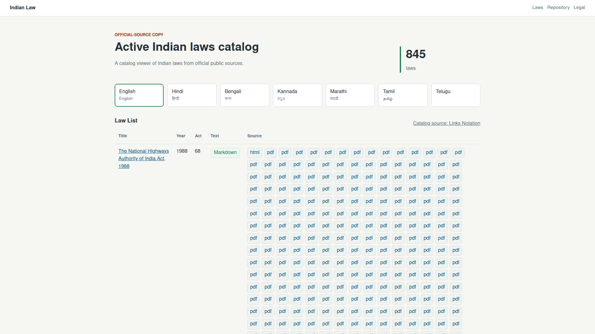

# Issue 23 Case Study

## Scope

Issue 23 reported that the public catalog still had pending laws in both English and Hindi even though the refresh workflow reported success. It also requested language-isolated views, clearer catalog metrics, a direct Links Notation catalog download, and a deep investigation of the source data and refresh logs.

## Evidence Captured

- Issue metadata and comments: `data/issue-23.json`, `data/issue-23-comments.json`
- PR metadata and comments: `data/pr-24.json`, `data/pr-24-conversation-comments.json`, `data/pr-24-review-comments.json`, `data/pr-24-reviews.json`
- Recent CI run lists: `data/recent-branch-runs.json`, `data/recent-main-runs.json`
- Refresh run metadata: `data/run-25634510392.json`
- Refresh run log archive and excerpt: `logs/run-25634510392.log.gz`, `logs/run-25634510392.excerpt.log`
- Live site and catalog captures: `data/live-home.html`, `data/live-root-catalog.lino.gz`, `data/live-catalog-summary.lino`
- Post-fix build evidence: `data/post-fix-cache-build.log.gz`, `data/post-fix-cache-build.excerpt.log`, `data/post-fix-catalog-summary.lino`
- Remaining Hindi source-only list: `data/post-fix-hindi-pending-pdfs.lino`
- Test and lint logs: `data/pre-fix-english-pdf-regression.log`, `data/post-fix-focused-tests.log`, `data/npm-test.log`, `data/git-diff-check.log`
- Playwright browser checks: `data/playwright-verification.txt`
- Browser verification screenshots: `images/issue-23-english-home.png`, `images/issue-23-hindi-home.png`

The screenshot files were verified with PNG magic bytes using `od` before being committed. The environment did not have `file` or `xxd` installed.

## CI and Live Catalog Findings

Refresh run `25634510392` completed successfully on `2026-05-10T17:07:30Z` for SHA `27fb66269b5e7fecbf95fa73c7062698c8b541e1`. The log shows `Generated 845 law entries in docs`, committed `Laws sync`, and reported a successful Pages deployment.

The workflow success was not a runtime failure, but it was incomplete as a content-quality signal. The live catalog captured at `2026-05-10T17:33:27.616Z` had all 845 laws loaded, but language text availability was:

| Language | Markdown | Source-only | Unavailable |
| --- | ---: | ---: | ---: |
| English | 795 | 50 | 0 |
| Hindi | 703 | 13 | 129 |
| Bengali | 0 | 0 | 845 |
| Kannada | 0 | 0 | 845 |
| Marathi | 0 | 0 | 845 |
| Tamil | 0 | 0 | 845 |
| Telugu | 0 | 0 | 845 |

The site serves the generated catalog from `https://law.satyavera.in/data/catalog.lino`. The path `https://law.satyavera.in/indian-law/data/catalog.lino` returned `404`; this matches the app asset base, which resolves catalog assets from the site root.

## Root Cause

The build already had PDF text extraction for non-English translations, but it skipped English PDF hydration. For English laws with no India Code HTML sections and a primary English PDF, the cache stayed source-only even when `pdfjs-dist` could extract text from the PDF.

The UI had a separate language leak: table source/status helpers and document route resolution could fall back to the default language. That made selected language pages capable of showing English availability or sources when the requested language was not ready.

The remaining Hindi source-only PDFs are a different class of problem. The current text extractor found no embedded text for those files, so they need an OCR stage before Markdown generation.

## Changes Made

- Extended PDF hydration so English laws with empty HTML sections can be populated from primary English PDFs.
- Rebuilt the cache and generated docs so English now has Markdown for all 845 cataloged laws.
- Removed language fallback from the catalog table, source links, and document route resolution.
- Changed enabled text labels to `Markdown`, pending source-only labels to `Pending`, and no-source labels to `Unavailable`.
- Changed the home metric to be scoped to the selected language: `845 laws` for complete languages, or `703/845 laws` for partial languages.
- Replaced the previous notation copy with a direct download link labeled `Catalog source: Links Notation`.
- Added regression tests for English PDF-backed laws and language status fallback.

## Post-Fix Status

After the fix, a fresh fetch build produced:

| Language | Markdown | Source-only | Unavailable |
| --- | ---: | ---: | ---: |
| English | 845 | 0 | 0 |
| Hindi | 703 | 13 | 129 |
| Bengali | 0 | 0 | 845 |
| Kannada | 0 | 0 | 845 |
| Marathi | 0 | 0 | 845 |
| Tamil | 0 | 0 | 845 |
| Telugu | 0 | 0 | 845 |

The 13 remaining Hindi source-only laws are listed in `data/post-fix-hindi-pending-pdfs.lino`. They have official Hindi PDF sources, but the current `pdfjs-dist` text extraction returned no sections. A practical follow-up is to add an OCR pass for these PDFs before Markdown generation, using a native OCR pipeline such as `ocrmypdf` with Tesseract or a JavaScript Tesseract-based fallback if the workflow must stay entirely in Node.

## Browser Verification

English catalog after the fix:



Hindi catalog after the fix:


Playwright verification confirmed:

- English renders `845 laws`.
- Hindi renders `703/845 laws`.
- No fallback messaging appears.
- The catalog source link downloads `data/catalog.lino`.
- A Hindi-unavailable document route does not render English Markdown; it returns to the Hindi catalog.

## Verification Commands

```sh
node --test --test-timeout=30000 --test-name-pattern "English PDF text|does not fall back" tests/build-site.test.mjs tests/catalog-status.test.mjs
node scripts/build-site.mjs --fetch --manifest data/laws.discovered.lino --regional-sources data/regional-sources.discovered.lino --cache-dir data/cache/laws --cache-ttl-days 30 --progress-file data/cache/refresh-status.lino --delay-ms 0
npm test
git diff --check
```
