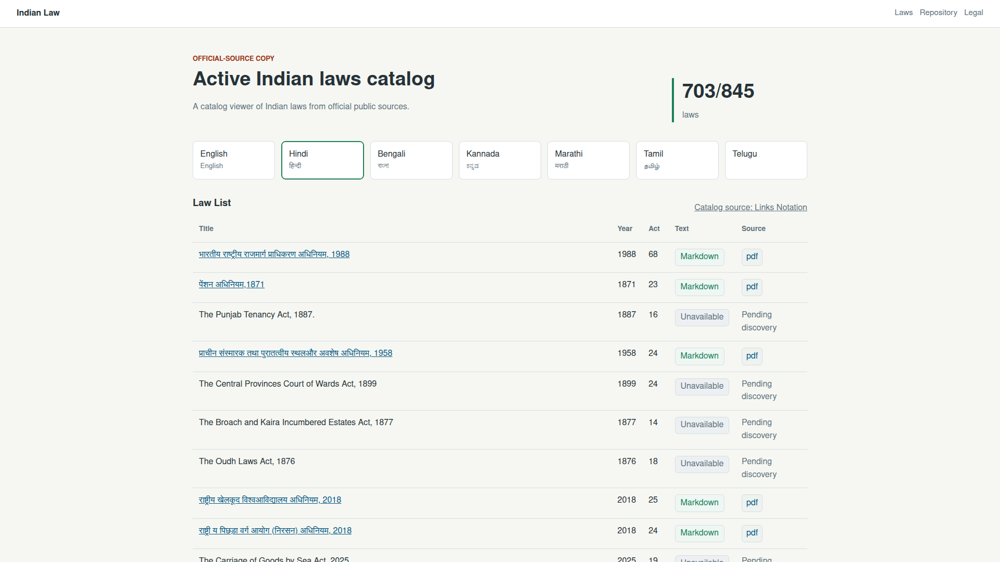
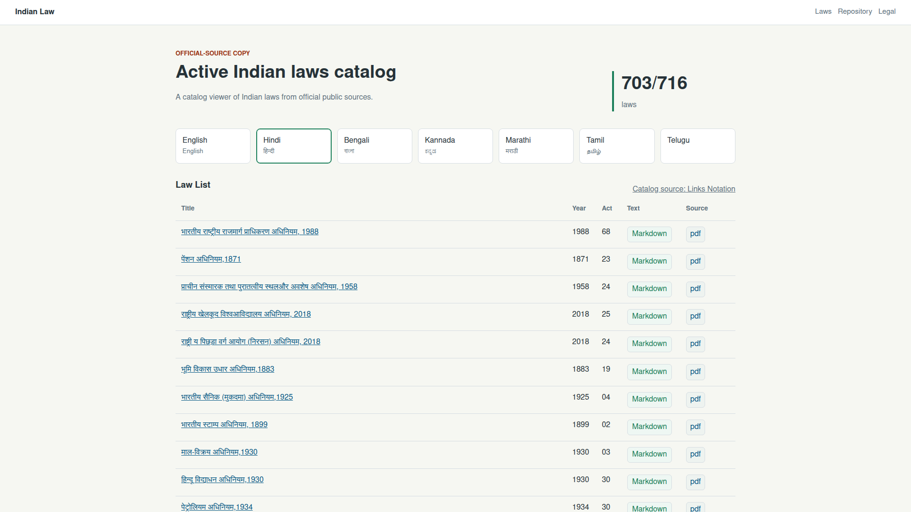
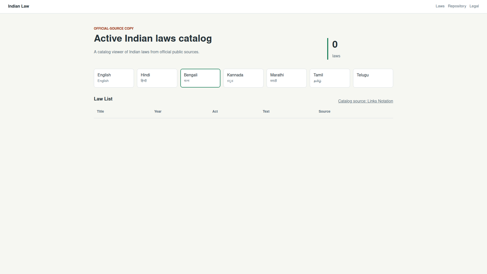

# Issue 25 Case Study

Issue: https://github.com/Svetozar-Technologies/indian-law/issues/25

Pull request: https://github.com/Svetozar-Technologies/indian-law/pull/26

Prepared branch: `issue-25-b6cc6f728482`

## Scope

Issue 25 reported that the live Hindi catalog still showed many `Unavailable | Pending discovery` rows after the latest refresh and that non-English pages should not show fallback-language content. It also requested a requirements document, a deep case study under `docs/case-studies/issue-25`, and preserved data/log evidence.

## Evidence Captured

- Issue and PR metadata: `data/issue-25.json`, `data/issue-25-comments.json`, `data/pr-26.json`, `data/pr-26-review-comments.json`, `data/pr-26-reviews.json`
- Recent CI run lists: `data/recent-branch-runs.json`, `data/recent-main-runs.json`
- Refresh run metadata and logs: `data/refresh-run-25637732889.json`, `logs/refresh-run-25637732889.log.gz`, `logs/refresh-run-25637732889.excerpt.log`
- Existing PR CI run evidence: `data/pr-ci-run-25638622080.json`, `logs/pr-ci-run-25638622080.log`
- Live site and catalog captures: `data/live-indian-law.html`, `data/live-indian-law-catalog-headers.txt`, `data/live-catalog-summary.json`, `data/live-catalog.lino.gz`
- Focused regression evidence: `data/pre-fix-catalog-status-test.log`, `data/post-fix-catalog-status-test.log`, `data/pre-fix-title-normalization-test.log`, `data/post-fix-title-normalization-test.log`
- Post-fix generated-output evidence: `data/post-fix-cache-build-2.log.gz`, `data/post-fix-cache-build-2.excerpt.log`, `data/post-fix-catalog-summary.json`
- Final local verification: `data/npm-test.log`, `data/offline-build.log`, `data/git-diff-check.log`
- Browser screenshots: `images/live-hindi-before.png`, `images/local-hindi-after.png`, `images/local-bengali-after.png`
- Dependency install evidence: `data/npm-ci.log`
- Case-study inventory: `data/evidence-file-list.txt`

The screenshot files were checked with PNG magic bytes using `od`. The environment did not have `file` installed.

## Timeline

| Time (UTC) | Event | Evidence |
| --- | --- | --- |
| 2026-05-10 19:30:51 | Main refresh run `25637732889` started. | `data/refresh-run-25637732889.json` |
| 2026-05-10 19:31:24 | Central Act discovery completed with 845 live laws and 0 discovery errors. | `logs/refresh-run-25637732889.excerpt.log` |
| 2026-05-10 19:31:24 to 19:32:23 | Regional-source discovery timed out for Bengali, Kannada, Marathi, Tamil, and Telugu source pages, then wrote 0 regional sources. | `logs/refresh-run-25637732889.excerpt.log` |
| 2026-05-10 19:37:32 | The refresh generated 845 law entries. | `logs/refresh-run-25637732889.excerpt.log` |
| 2026-05-10 19:37:33 | The refresh committed `40ca1e1` with message `Laws sync`. | `logs/refresh-run-25637732889.excerpt.log` |
| 2026-05-10 19:37:52 | GitHub Pages deployment reported success. | `logs/refresh-run-25637732889.excerpt.log` |
| 2026-05-10 20:15 | Live Hindi page reproduced the reported fallback behavior. | `images/live-hindi-before.png` |
| 2026-05-10 20:32 | Post-fix cached build regenerated 845 law entries locally. | `data/post-fix-cache-build-2.excerpt.log` |
| 2026-05-10 20:35 | Local browser checks confirmed the Hindi and Bengali language-isolated views. | `images/local-hindi-after.png`, `images/local-bengali-after.png` |

## Live Findings

The latest main refresh was not failing. Run `25637732889` completed, committed generated docs and cache changes, and deployed GitHub Pages successfully.

The live generated catalog still had partial selected-language availability:

| Language | Markdown | Source-only | Unavailable |
| --- | ---: | ---: | ---: |
| English | 845 | 0 | 0 |
| Hindi | 703 | 13 | 129 |
| Bengali | 0 | 0 | 845 |
| Kannada | 0 | 0 | 845 |
| Marathi | 0 | 0 | 845 |
| Tamil | 0 | 0 | 845 |
| Telugu | 0 | 0 | 845 |

The live app served the catalog from `https://law.satyavera.in/data/catalog.lino`. The `/indian-law/` alias shell uses an asset base that points one directory up, so `https://law.satyavera.in/indian-law/data/catalog.lino` returned `404` during the investigation.

## Root Cause

There were two separate issues.

First, the UI listed every catalog law on every language route. For Hindi this meant all 845 default catalog laws appeared, including the 129 laws with no known Hindi text or Hindi source. For regional-language routes with no discovered sources, the same logic could show the full English-backed catalog as unavailable fallback rows.

Second, title and document metadata helpers fell back to default-language data. Non-English rows could use `law.title`, and document pages could show English long titles and ministries even when the selected language was not English.

The investigation also found a generator hygiene issue: upstream PDF links can have literal placeholder text such as `null`. The parser and Markdown generator preserved those placeholders as source titles and localized Markdown headings.

## Implemented Fix

- Added catalog helpers that filter a selected-language view to laws with selected-language Markdown or selected-language source links.
- Changed the home metric to use selected-language visible totals. Hindi now reports `703/716 laws`; Bengali and the other regional routes report `0 laws` while no selected-language sources are known.
- Removed default-language title fallback from non-English catalog rows and generated localized Markdown titles. Missing localized titles now use a neutral act metadata label.
- Hid default-language long title and ministry metadata from non-default document pages.
- Sanitized placeholder source/title values from India Code parsing, PDF hydration, catalog source metadata, and generated Markdown.
- Added focused tests for selected-language filtering, non-default title fallback, placeholder PDF link parsing, and localized Markdown title normalization.
- Added `docs/REQUIREMENTS.md` to capture the language-isolation, source-status, refresh, and review requirements.

## Post-Fix Status

After the local post-fix cached build:

| Language | Markdown | Source-only | Unavailable | Visible in route |
| --- | ---: | ---: | ---: | ---: |
| English | 845 | 0 | 0 | 845 |
| Hindi | 703 | 13 | 129 | 716 |
| Bengali | 0 | 0 | 845 | 0 |
| Kannada | 0 | 0 | 845 | 0 |
| Marathi | 0 | 0 | 845 | 0 |
| Tamil | 0 | 0 | 845 | 0 |
| Telugu | 0 | 0 | 845 | 0 |

The remaining 13 Hindi source-only laws have official Hindi PDF sources but no generated Markdown yet. The remaining 129 Hindi-unavailable laws have no known Hindi source in the current discovery data. The regional-language source pages timed out in the latest refresh run, so those languages correctly show no visible rows rather than fallback English rows.

## Browser Verification

Live Hindi page before the fix, showing fallback unavailable rows:



Local Hindi page after the fix, scoped to selected-language laws:



Local Bengali page after the fix, showing no fallback rows:



## Regression Tests

Focused catalog reproduction before the fix:

```sh
node --test --test-timeout=30000 tests/catalog-status.test.mjs > docs/case-studies/issue-25/data/pre-fix-catalog-status-test.log 2>&1
```

Result: failed before implementation because the new selected-language filtering helper did not exist.

Focused title/source normalization reproduction before the fix:

```sh
node --test --test-timeout=30000 tests/html.test.mjs tests/markdown.test.mjs > docs/case-studies/issue-25/data/pre-fix-title-normalization-test.log 2>&1
```

Result: failed because placeholder `null` source titles and headings were preserved.

Focused verification after the fix:

```sh
node --test --test-timeout=30000 tests/catalog-status.test.mjs > docs/case-studies/issue-25/data/post-fix-catalog-status-test.log 2>&1
node --test --test-timeout=30000 tests/html.test.mjs tests/markdown.test.mjs > docs/case-studies/issue-25/data/post-fix-title-normalization-test.log 2>&1
```

Results: all focused tests passed.

Full local verification:

```sh
npm test > docs/case-studies/issue-25/data/npm-test.log 2>&1
node scripts/build-site.mjs --offline --output /tmp/indian-law-offline-site > docs/case-studies/issue-25/data/offline-build.log 2>&1
git diff --check > docs/case-studies/issue-25/data/git-diff-check.log 2>&1
```

Results:

- `npm test`: 42/42 passing.
- Offline build: generated 4 law entries in `/tmp/indian-law-offline-site`.
- `git diff --check`: passing.

## Remaining Work

- Add OCR for official Hindi PDFs that have no embedded extractable text.
- Improve regional-source fetch resilience or add alternate official regional source discovery when Legislative Department regional pages time out.
- Let CI publish the branch build, then verify that the public Hindi route matches the local `703/716 laws` behavior.
